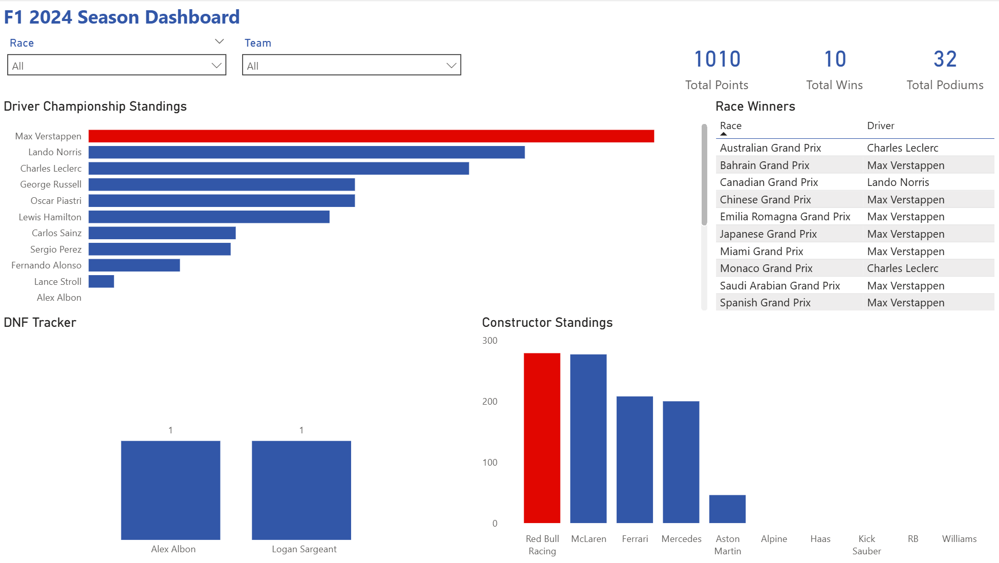
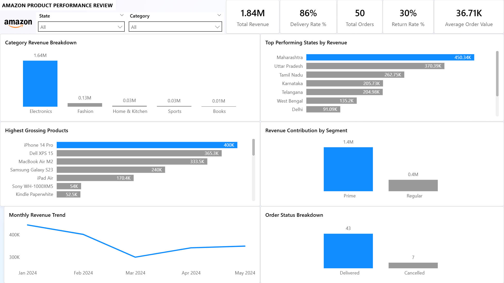
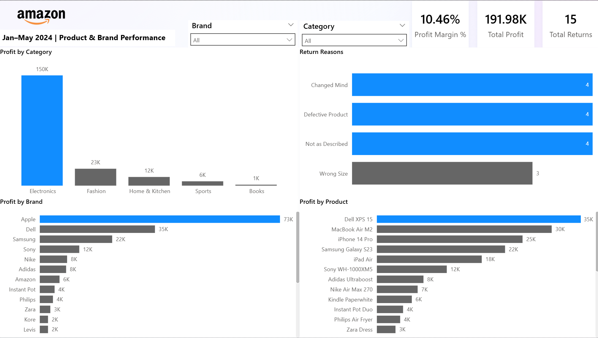
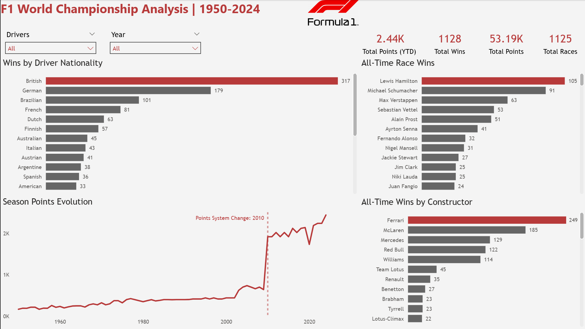
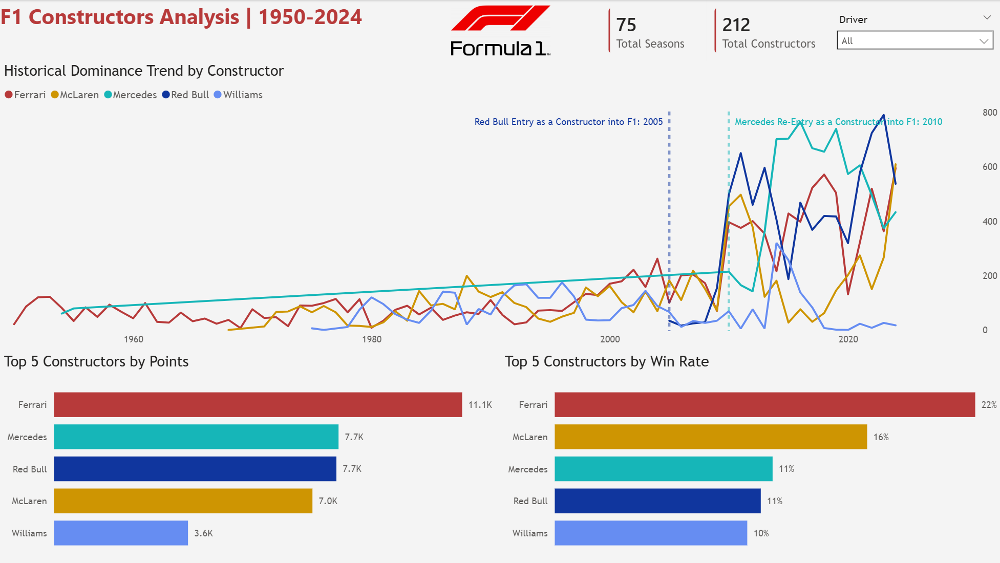
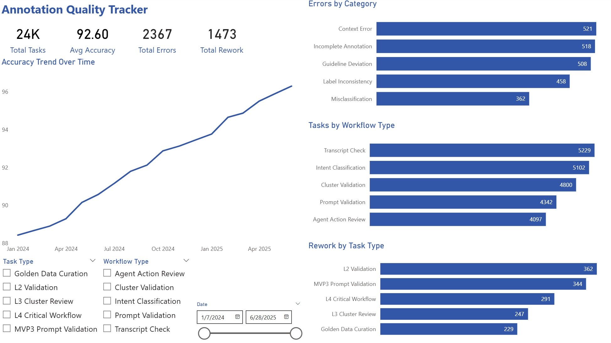
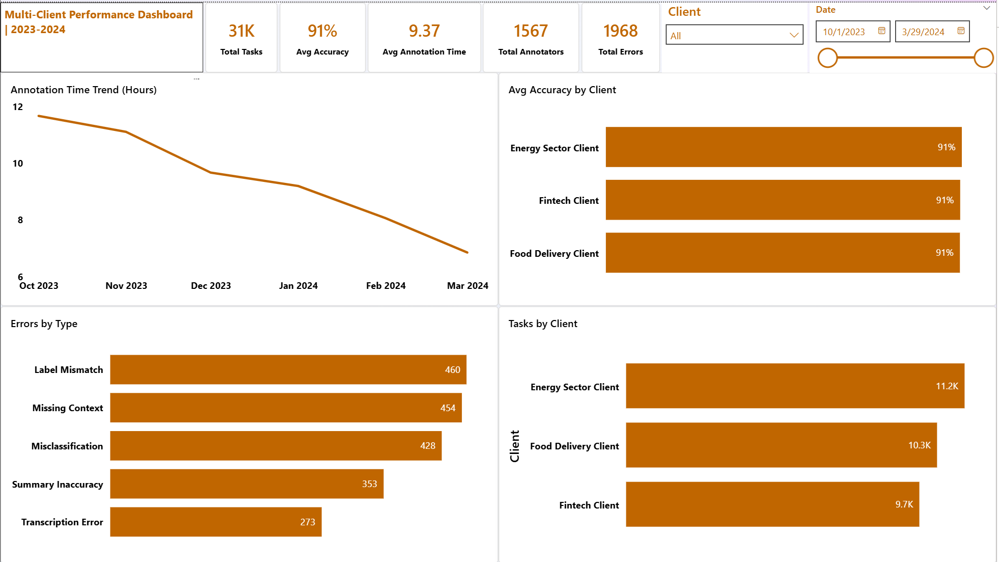

# Power BI Dashboards Portfolio

A collection of Power BI dashboards built as part of my Data Analyst portfolio.

## Dashboards

### 1. F1 2024 Season Analysis (Beginner)
- Driver championship standings, race winners, DNF tracker
- Features: DAX measures, slicers, KPI cards

### 2. Amazon Ecommerce Analysis (Intermediate)
- Sales overview, product analysis across 2 pages
- Features: Multi-table data model, revenue/profit/return metrics

### 3. F1 World Championship Historical Analysis (Advanced)
- 70 years of F1 data (1950-2024)
- Features: Time Intelligence DAX, Date Table, constructor & driver analysis

### 4. Annotation Quality Tracker (Freelance Project)
- Tracks annotation accuracy, error rates, and rework trends across workflows
- Accuracy trend from 88% → 96% over 18 months visualised using DAX time intelligence
- Slicers for Task Type, Workflow Type, and Date Range for interactive filtering
- KPI cards: Total Tasks, Avg Accuracy, Total Errors, Total Rework

### 5. Multi-Client Performance Dashboard (Freelance Project)
- Tracks annotation time, accuracy, and error trends across 3 client accounts
- Annotation time trend shows clear reduction from 11.7hrs → 6.8hrs over 6 months
- Comparative analysis across Food Delivery, Energy, and Fintech clients
- KPI cards: Total Tasks, Avg Accuracy, Avg Annotation Time, Total Errors, Total Annotators

  
## Tools Used
- Power BI Desktop
- Power Query (M Language)
- DAX

## Dashboard Previews

### F1 2024 Season Analysis (Beginner)

### Amazon Ecommerce Analysis - Page 1 (Intermediate)

### Amazon Ecommerce Analysis - Page 2 (Intermediate)

### F1 Kaggle Historical Analysis - Page 1 (Advanced)

### F1 Kaggle Historical Analysis - Page 2 (Advanced)

### Annotation Quality Tracker (Freelance Project)

### 4. Multi-Client Performance Dashboard (Freelance Project)

## Author
Bhargav Rao — Data Analyst Portfolio
